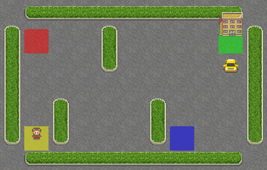

<p align="center">
  <br>
  <em>The Taxi agent efficiently navigating the 5×5 grid!</em>
</p>

<br><br>


# 🚖 Taxi with Policy Iteration 🚀

Welcome to the **Taxi** environment, where we’ll guide our little yellow taxi around the city using the **policy iteration algorithm**! 🌟

Ready to help our driver get the passengers to their destinations? Let’s jump in! 🎮

<br><br>

## 🏙️ About the Taxi-v3 Environment

In the **Taxi-v3** environment from **Gymnasium**, our goal is to help a taxi driver pick up and drop off passengers at various locations on a grid world. The environment teaches reinforcement learning agents how to make optimal decisions in a discrete, grid-based world.

The taxi moves on a **5×5 grid**, navigating between landmarks to pick up and drop off passengers as efficiently as possible.

---

### 🚗 States

Each **state** in Taxi-v3 represents a unique combination of:

* The **taxi’s position** (on a 5×5 grid → 25 possible positions).
* The **passenger’s location** (5 possible: 🟥 **R**, 🟩 **G**, 🟨 **Y**, 🟦 **B**, or “in taxi”).
* The **destination** (4 possible: R, G, Y, or B).

So the **total number of states** is:

```markdown
Total states = 25 (taxi positions) × 5 (passenger locations) × 4 (destinations) = 500 states
```

Each of these 500 states represents a unique configuration of the environment.

---

### 📊 Space Info

| Space Type                | Description                                                                           |
| ------------------------- | ------------------------------------------------------------------------------------- |
| **Passenger locations**   | 5 (R, G, Y, B, or “in taxi”)                                                          |
| **Destination locations** | 4 (R, G, Y, B)                                                                        |
| **Observation space**     | 5 rows × 5 columns × 5 passenger locations × 4 destinations = **500 states**          |
| **State representation**  | The environment uses a single integer (**0–499**) to represent each state internally. |

---

### 🔍 Space Decoding

You can decode a state index into its grid representation like this:

```python
import gymnasium as gym

env = gym.make("Taxi-v3")
state = 123
decoded = env.unwrapped.decode(state)
print(decoded)  # (taxi_row, taxi_col, passenger_location, destination)
```

---

### 🧩 Space Encoding

You can also encode specific grid positions back into a single integer state:

```python
encoded = env.unwrapped.encode(taxi_row, taxi_col, passenger_loc, destination)
```

---

### 🎮 Actions

The action space is discrete, with **6 possible actions**:

| Action | Description           |
| ------ | --------------------- |
| **0**  | Move South ⬇️         |
| **1**  | Move North ⬆️         |
| **2**  | Move East ➡️          |
| **3**  | Move West ⬅️          |
| **4**  | Pick up passenger 🚕  |
| **5**  | Drop off passenger 🎯 |

---

### 💡 Rewards

| Action Type             | Reward  |
| ----------------------- | ------- |
| Successful drop-off     | **+20** |
| Each time step          | **-1**  |
| Invalid pickup/drop-off | **-10** |

A successful episode means picking up and dropping off a passenger correctly and efficiently to maximize cumulative reward. 🏅

---

### 🔄 Transition Probabilities

In reinforcement learning, the **transition probabilities** define how likely it is to move from one state to another after taking a specific action.

In Taxi-v3, these are accessible via:

```python
env.unwrapped.P[s][a]
```

Each entry gives a list of tuples `(probability, next_state, reward, terminated)` for all possible outcomes from state `s` with action `a`.

Example:

```python
env.unwrapped.P[1][4]
```

returns all transitions from state **1** after taking **action 4 (pickup)**.

These probabilities are essential for computing expected returns in **value iteration**.

---


## 🛠️ Let’s Set Up Taxi-v3! 🚕

Before we start driving around with **Taxi-v3**, let’s get everything ready! 🙌
You’ll need the **uv** package and project manager installed to make sure your environment is clean, reproducible, and easy to manage. 🧰

You can grab **uv** from its [GitHub repository](https://github.com/astral-sh/uv), or just run this one-liner to install it:

```bash
# On macOS and Linux.
curl -LsSf https://astral.sh/uv/install.sh | sh
```

Now, why are we using **uv**? 🤔
Because it’s our pit crew! 🏎️ It ensures that every project has the right Python setup and dependencies — no conflicts, no mess.
This way, you’ll be able to run **Taxi-v3** smoothly without any detours. 🎯

---

### 📦 Initialize the Example:

Let’s create a clean environment for our Taxi project. 🚦

```bash
# Pin Python version
uv python pin 3.12

# Initialize a new project
uv init 003 && cd 003
# we are in examples/003
# Remove the default main.py if created
rm main.py

# Create a virtual environment to ensure version consistency
uv venv --python 3.12 # just for sure
```

Almost ready! But before we hit the road, we need to install a few dependencies. 🧩

---

### 📥 Install Project Dependencies:

Time to install the necessary packages for the experiment so everything works as expected! 💻✨

Make sure you're in the **examples/003/** directory and run:


```bash
# you must be in path examples/003/
uv add -r requirements.txt
```

---

### 🚀 Launch Jupyter Notebook:

Now that everything’s set up, let’s start our engines and open Jupyter to begin exploring the **Taxi-v3** world! 🎮

```bash
uv run jupyter notebook --ip='*' --NotebookApp.token='' --NotebookApp.password=''
```

There you go! Everything’s ready for you to start training and testing your **Taxi** agent. 🚕

With **Policy Iteration**, your agent will discover the **optimal strategy** — moving efficiently, avoiding penalties, and maximizing rewards.

Let’s make this taxi the most efficient cab in the city! 💛✨

---
