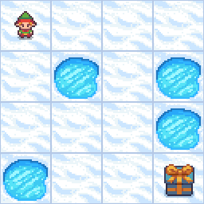

<p align="center">
  <br>
  <em>The FrozenLake agent efficiently navigating the 4×4 grid!</em>
</p>


<br><br>


# 🧊 Frozen Lake with Monte Carlo Every-Visit Control 🎯

Welcome to the **Frozen Lake** environment! Here, our goal is to teach an agent to navigate from the start to the goal safely, avoiding holes, using **Monte Carlo Every-Visit Control**. 🌟

This algorithm is **model-free**, meaning it **does not require knowing the environment’s transition probabilities**. The agent learns optimal behavior **entirely from experience** by exploring and observing the rewards it collects.

---

## ❄️ About the FrozenLake-v1 Environment

**FrozenLake-v1** from **Gymnasium** is a **grid world** representing a frozen lake:

* Safe frozen tiles (`F`)
* Holes (`H`) that terminate the episode
* Start (`S`) and goal (`G`) tiles

The standard **4×4 grid**:

* `is_slippery=False` → deterministic movement
* `is_slippery=True` → stochastic/slippery movement

---

### 🏔️ States

Each **state** represents the agent’s position on the lake:

```markdown
Total states = 4 rows × 4 columns = 16 states
```

Each state is encoded as:

```markdown
state_index = row * ncols + col
```

For example, the **goal state** is:

```markdown
goal_state = 3 * 4 + 3 = 15
```

---

### 📊 Space Info

| Space Type               | Description                                |
| ------------------------ | ------------------------------------------ |
| **Observation space**    | 16 (4×4 grid positions)                    |
| **State representation** | Single integer 0–15                        |
| **Action space**         | 4 possible actions (left, down, right, up) |

---

### 🎮 Actions

| Action | Description   |
| ------ | ------------- |
| **0**  | Move Left ⬅️  |
| **1**  | Move Down ⬇️  |
| **2**  | Move Right ➡️ |
| **3**  | Move Up ⬆️    |

---

### 💡 Rewards

| Event               | Reward |
| ------------------- | ------ |
| Reach Goal          | **+1** |
| Fall into Hole      | 0      |
| Step on Frozen Tile | 0      |

A successful episode means reaching the goal **without falling into holes**. 🏅

---

## 🧠 Monte Carlo Every-Visit Control

**Monte Carlo Every-Visit Control** is a **model-free reinforcement learning algorithm**. The agent **learns from experience** by exploring the environment, collecting episodes, and updating the action-value function **for every time a state-action pair is visited in that episode**.

---

### 🔄 Exploration & Epsilon Decay

At the beginning, the agent knows nothing about the environment. To encourage learning:

* We use an **ε-greedy policy**, where the agent sometimes explores random actions.
* After **half of the episodes**, ε is gradually **reduced** to favor exploitation of the learned Q-values.

---

### 🧾 Algorithm: Monte Carlo Every-Visit Control


**Input:**
- Environment with state set **S** and action set **A**
- Discount factor **γ ∈ [0, 1)**
- Number of episodes **N**
- Exploration rate **ε** for ε-greedy policy

**Output:**
- Optimal action-value function **Q\*(s, a)**
- Optimal policy **π\*(s)**

**Steps:**
1. Initialize **Q(s, a)** and **returns[(s, a)]** arbitrarily (e.g., zeros)
2. For each episode **1..N**:
   - Generate an episode using **ε-greedy policy**
   - Compute return **Gₜ** for each step in **reverse order**
   - Update **Q(s, a)** for **every visit** in the episode
   - Optionally decay **ε** after half of episodes
3. Derive optimal policy **π\*(s) = argmaxₐ Q(s, a)**


---


### 🧭 Intuition

1. Start with **no knowledge** of the environment.
2. Explore with **ε-greedy policy** → collect episodes and rewards.
3. Update Q-values **for every visit** to capture all learning signals.
4. Gradually reduce exploration (decay ε) to exploit learned values.
5. Derive **optimal policy** from Q(s, a) → agent learns to safely reach the goal.

---

## 🛠️ Let’s Set Up FrozenLake-v1! ❄️

```bash
# Install uv package
curl -LsSf https://astral.sh/uv/install.sh | sh
```

---

### 📦 Initialize the Example

```bash
# we need to be in examples/005
cd examples/005

# Pin Python version
uv python pin 3.12

# Initialize new project
uv init
rm main.py

# Create virtual environment
uv venv --python 3.12
```

---

### 📥 Install Project Dependencies

```bash
# Inside examples/005/
uv add -r requirements.txt
```

---

### 🚀 Launch Jupyter Notebook

```bash
uv run jupyter notebook --ip='*' --NotebookApp.token='' --NotebookApp.password=''
```

Your Frozen Lake agent is now ready to **learn optimal navigation using Monte Carlo Every-Visit Control**! 🧊✨

---


