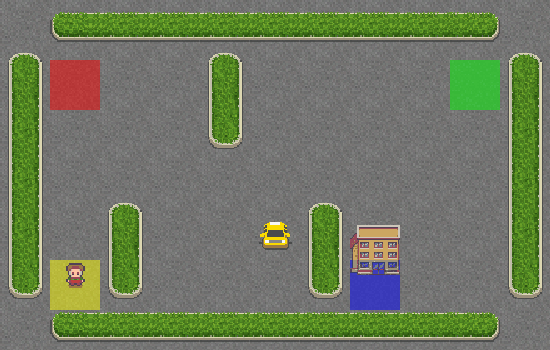
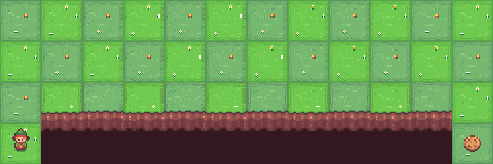

<p align="center">
  <br>
  <em>The Taxi-v3 agent efficiently navigating the grid world using SARSA!</em>
</p>

<p align="center">
  <br>
  <em>Cliff walking trianed by SARSA!</em>
</p>

<br><br>

# 🚕 Taxi-v3 & CliffWalking-v1 with SARSA (State–Action–Reward–State–Action) 🎯

Welcome to the **Taxi-v3** and **CliffWalking-v1** environments!
In this project, we teach an agent to learn **optimal policies** in two classic reinforcement learning environments using the **SARSA** algorithm — a powerful **on-policy temporal-difference (TD) control method**. 🌟

SARSA (State–Action–Reward–State–Action) is **model-free**, meaning it **does not rely on transition probabilities**. The agent learns directly from its interactions, continuously improving its policy as it balances **exploration** and **exploitation**.

## **SARSA: A Brief Overview**

**SARSA (State–Action–Reward–State–Action)** is a fundamental reinforcement learning algorithm used to find the optimal policy of an agent interacting with an environment. It is an **on-policy** algorithm, meaning that the agent learns from the actions it actually takes.

SARSA is a **model-free** method, meaning it doesn't rely on knowledge of the transition dynamics of the environment (i.e., the probability of moving from one state to another). SARSA is **on-policy** because it updates the policy based on the actions it actually takes in the environment, rather than the best possible actions in hindsight. In other words, the policy that the agent is learning is the same policy that is being used to generate behavior. This is in contrast to **off-policy** algorithms like Q-learning, where the policy used for learning is different from the policy being followed by the agent.

In SARSA, the agent chooses actions based on its current policy (often using an **ε-greedy** strategy to balance exploration and exploitation), then observes the resulting state and reward, and updates the policy accordingly. The key update rule in SARSA is the following:

%20%5Cleftarrow%20Q(s_t%2C%20a_t)%20%2B%20%5Calpha%20%5Cleft%5B%20r_%7Bt%2B1%7D%20%2B%20%5Cgamma%20Q(s_%7Bt%2B1%7D%2C%20a_%7Bt%2B1%7D)%20-%20Q(s_t%2C%20a_t)%20%5Cright%5D)

Where:

* ) is the action-value function (which estimates the return expected after taking action  in state ),
*  is the reward received after performing action ,
*  is the discount factor (indicating the importance of future rewards),
*  is the learning rate (indicating how much new information should override the old value),
*  is the action taken in the next state , chosen according to the policy.

This update rule reflects that SARSA is always learning from the action actually taken, and not necessarily the optimal action in the state.


### **Exploration vs. Exploitation in SARSA**

A key challenge in reinforcement learning is balancing **exploration** (trying new actions to discover better ones) with **exploitation** (choosing the action that has the highest expected reward based on current knowledge). SARSA handles this balance with its use of an **ε-greedy** strategy (or similar methods), where:

* With probability ( 1 - ε ), the agent chooses the action with the highest estimated reward (exploitation).
* With probability ( ε ), the agent chooses a random action (exploration).

This stochastic behavior ensures that the agent does not prematurely settle on a suboptimal policy, allowing it to continue exploring potentially better solutions throughout the learning process.

### **SARSA in Taxi-v3 & CliffWalking-v1**

In both the **Taxi-v3** and **CliffWalking-v1** environments, the SARSA algorithm is used to learn the optimal policies for navigating the environment:

* **Taxi-v3**: The agent must navigate a taxi through a grid world to pick up and drop off passengers at specific locations. The task is to learn the best actions for picking up passengers and delivering them to their destination while minimizing the number of steps and avoiding penalties.

* **CliffWalking-v1**: The agent must move across a grid, avoiding a "cliff" where falling results in a high penalty. The objective is to learn the optimal path across the grid while avoiding dangerous areas and minimizing penalties.

In both environments, SARSA learns through trial and error by constantly updating the action-value function based on the feedback received after each action.


---


## 🚖 About the Taxi-v3 Environment

**Taxi-v3** from **Gymnasium** simulates a taxi navigating a grid world to **pick up and drop off passengers** at designated locations.

### 🎯 Objective

Pick up the passenger at one location and drop them off at the destination with the **fewest possible steps**.

---

### 📊 Space Info (Taxi-v3)

| Space Type            | Description                                                                  |
| --------------------- | ---------------------------------------------------------------------------- |
| **Observation space** | 500 discrete states (taxi row, taxi column, passenger location, destination) |
| **Action space**      | 6 discrete actions                                                           |

---

### 🎮 Actions

| Action | Description   |
| ------ | ------------- |
| **0**  | Move South ⬇️ |
| **1**  | Move North ⬆️ |
| **2**  | Move East ➡️  |
| **3**  | Move West ⬅️  |
| **4**  | Pick Up 🚖    |
| **5**  | Drop Off 🎯   |

---

### 💡 Rewards

| Event               | Reward  |
| ------------------- | ------- |
| Successful drop-off | **+20** |
| Each timestep       | **-1**  |
| Illegal pickup/drop | **-10** |

---

## 🧗 About the CliffWalking-v1 Environment

**CliffWalking-v1** represents an agent navigating a **grid world** where it must reach the goal without falling off the cliff.

### 🎯 Objective

Move from the **start (S)** to the **goal (G)** while avoiding the **cliff region** that yields a large penalty.

---

### 📊 Space Info (CliffWalking-v1)

| Space Type            | Description                    |
| --------------------- | ------------------------------ |
| **Observation space** | 48 discrete states (4×12 grid) |
| **Action space**      | 4 actions                      |

Indeed there are 3 x 12 + 1 possible states. The player cannot be at the cliff, nor at the goal as the latter results in the end of the episode. What remains are all the positions of the first 3 rows plus the bottom-left cell.

---

### 🎮 Actions

| Action | Description   |
| ------ | ------------- |
| **0**  | Move Left ⬅️  |
| **1**  | Move Down ⬇️  |
| **2**  | Move Right ➡️ |
| **3**  | Move Up ⬆️    |

---

### 💡 Rewards

| Event          | Reward   |
| -------------- | -------- |
| Reach Goal     | **0**    |
| Step Normally  | **-1**   |
| Fall off Cliff | **-100** |

A successful agent must **balance risk and reward**, learning to avoid the cliff while reaching the goal efficiently. ⚡

---

## 🧠 SARSA Algorithm Overview

**SARSA** is an **on-policy Temporal-Difference control algorithm**.
It updates its **Q-values** based on the action actually taken under the current policy — not the greedy action as in Q-learning.

---

### 🔄 Key Idea

At each step, the agent observes:

```
(s, a, r, s', a')
```

Then updates the Q-value as:

```
Q(s, a) ← Q(s, a) + α [r + γ Q(s', a') − Q(s, a)]
```

Where:

* **α** = learning rate
* **γ** = discount factor
* **r** = reward received after taking action **a** in state **s**
* **a'** = next action chosen according to the current ε-greedy policy

---

### 🧾 Algorithm: SARSA

**Input:**

* Environment with state set **S** and action set **A**
* Learning rate **α**
* Discount factor **γ ∈ [0, 1)**
* Exploration rate **ε** for ε-greedy policy
* Number of episodes **N**

**Output:**

* Optimal action-value function **Q*(s, a)**
* Policy **π*(s)**

**Steps:**

1. Initialize **Q(s, a)** arbitrarily (e.g., zeros)
2. For each episode:

   * Initialize **s**
   * Choose **a** from **s** using ε-greedy policy derived from **Q**
   * For each step in the episode:

     * Take action **a**, observe reward **r** and next state **s'**
     * Choose **a'** from **s'** using ε-greedy policy
     * Update:
       `Q(s, a) ← Q(s, a) + α [r + γ Q(s', a') − Q(s, a)]`
     * Set **s ← s'**, **a ← a'**
   * Optionally decay **ε**
3. Derive **π*(s) = argmaxₐ Q(s, a)**

---

### 🧭 Intuition

1. Start by exploring the environment randomly.
2. Update the Q-values using the **current policy’s next action**.
3. Gradually shift from exploration to exploitation by **decaying ε**.
4. Learn safe, efficient, and optimal navigation policies for both environments.

---

## 🛠️ Let’s Set Up the Project! 🚀

```bash
# Install uv package
curl -LsSf https://astral.sh/uv/install.sh | sh
```

---

### 📦 Initialize the Example

```bash
# Navigate to the example folder
cd examples/006

# Pin Python version
uv python pin 3.12

# Initialize new project
uv init
rm main.py

# Create virtual environment
uv venv --python 3.12
```

---

### 📥 Install Project Dependencies

```bash
# Inside examples/006/
uv add -r requirements.txt
```

---

### 🚀 Launch Jupyter Notebook

```bash
uv run jupyter notebook --ip='*' --NotebookApp.token='' --NotebookApp.password=''
```

Your **SARSA agent** is now ready to learn optimal navigation in **Taxi-v3** and **CliffWalking-v1**! 🧠⚡


