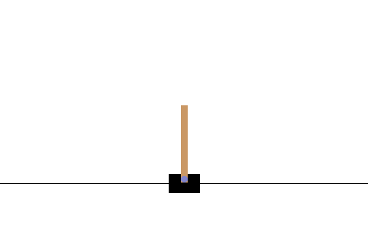
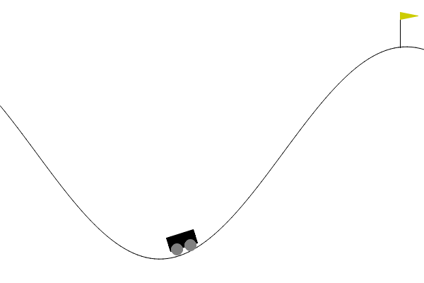

<p align="center">
  <br>
  <em>The CartPole-v1 agent balancing the pole using SARSA!</em>
</p>

<p align="center">
  <br>
  <em>The MountainCar-v0 agent reaching the hilltop using SARSA!</em>
</p>

<br><br>

# 🧠 CartPole-v1 & MountainCar-v0 with SARSA (State–Action–Reward–State–Action) 🎯

Welcome to the **CartPole-v1** and **MountainCar-v0** environments!
In this project, we teach agents to learn **optimal control policies** in two classic **continuous-state, discrete-action** environments using the **SARSA** algorithm — a powerful **on-policy Temporal-Difference (TD) control** method. 🌟

Both environments provide **continuous observations**, which means the agent’s state cannot be directly represented as discrete indices.
To handle this, we **discretize the continuous state space** into manageable “buckets,” allowing the SARSA algorithm to operate with a **Q-table** structure.

---

## ⚙️ Continuous State Spaces, Discrete Actions

| Environment        | Observation Space                                                 | Action Space                           | Solution             |
| ------------------ | ----------------------------------------------------------------- | -------------------------------------- | -------------------- |
| **CartPole-v1**    | 4 continuous values (position, velocity, angle, angular velocity) | 2 discrete actions (Left, Right)       | Discretize into bins |
| **MountainCar-v0** | 2 continuous values (position, velocity)                          | 3 discrete actions (Left, None, Right) | Discretize into bins |

Both environments are **continuous in state** but **discrete in action** — meaning the agent must learn which discrete control to apply in a smoothly changing world.
We handle this by **dividing each continuous variable into intervals (“bins”)**, assigning each observation to a discrete state index.

---

## 🧩 SARSA: A Quick Overview

**SARSA (State–Action–Reward–State–Action)** is a **model-free, on-policy** reinforcement learning algorithm.
It learns by **direct interaction** with the environment, updating its estimates based on **the action actually taken**, not the best possible one as in Q-learning.

The SARSA update rule is:

%20%5Cleftarrow%20Q\(s_t%2C%20a_t\)%20%2B%20%5Calpha%20%5Cleft%5B%20r_%7Bt%2B1%7D%20%2B%20%5Cgamma%20Q\(s_%7Bt%2B1%7D%2C%20a_%7Bt%2B1%7D\)%20-%20Q\(s_t%2C%20a_t\)%20%5Cright%5D)

Where:

* **Q(s, a)** → Estimated value of taking action *a* in state *s*
* **r** → Immediate reward
* **α** → Learning rate
* **γ** → Discount factor
* **a’** → Next action chosen by the same policy (ε-greedy)

---

### 🎯 Balancing Exploration and Exploitation

SARSA uses **ε-greedy action selection** to balance:

* **Exploration** → trying random actions to discover new strategies
* **Exploitation** → choosing the best-known action so far

At each step:

* With probability **ε**, the agent explores (random action)
* With probability **1−ε**, it exploits (greedy action)

Over time, **ε decays**, meaning the agent gradually shifts from exploration to confident exploitation.

---

## 🏋️ About the CartPole-v1 Environment

**CartPole-v1** is a **classic control problem** where a pole is attached to a cart moving along a frictionless track.

### 🎯 Objective

Keep the pole balanced upright by applying discrete forces to move the cart **left** or **right**.

---

### 📊 Space Information

| Space Type            | Description                                                          |
| --------------------- | -------------------------------------------------------------------- |
| **Observation space** | 4 continuous variables (position, velocity, angle, angular velocity) |
| **Action space**      | 2 discrete actions: left (0) or right (1)                            |

---

### 💡 Reward System

| Event                                 | Reward                 |
| ------------------------------------- | ---------------------- |
| Every time step pole stays upright    | **+1**                 |
| Pole falls or cart moves out of range | Episode ends (failure) |

A successful agent can achieve **up to ~500 reward** in a single episode by keeping the pole balanced for the entire duration.

---

## 🚗 About the MountainCar-v0 Environment

**MountainCar-v0** challenges the agent to drive a car up a steep hill using momentum — not raw acceleration.

### 🎯 Objective

Reach the **goal position (x ≥ 0.5)** at the top of the right hill as quickly as possible.

---

### 📊 Space Information

| Space Type            | Description                                                    |
| --------------------- | -------------------------------------------------------------- |
| **Observation space** | 2 continuous variables: position and velocity                  |
| **Action space**      | 3 discrete actions: push left (0), no push (1), push right (2) |

---

### 💡 Reward System

| Event          | Reward                       |
| -------------- | ---------------------------- |
| Each time step | **−1**                       |
| Reaching goal  | Episode terminates (success) |

The goal is to minimize the number of steps — so **higher (less negative) total reward** means a more efficient climb.

---

## 🧠 SARSA Algorithm Recap

At each time step, the agent observes a tuple:

```
(s, a, r, s', a')
```

and updates its Q-table as:

```
Q(s, a) ← Q(s, a) + α [r + γ Q(s', a') − Q(s, a)]
```

Because both environments have **continuous state spaces**, we first **discretize observations into bins**, then index the Q-table using the discretized state.

---

### 🧾 Algorithm: SARSA for Continuous-State Environments

1. **Discretize the Observation Space**

   * Divide each dimension of the continuous observation space into a fixed number of bins.
   * Each continuous state is mapped to a discrete **state index**, which will be used to index the Q-table.

2. **Initialize** Q-table `Q[s_index, a]` arbitrarily (e.g., zeros), where `s_index` corresponds to the **index of the discretized state** and `a` is a discrete action.

3. **For each episode**:

   * Reset the environment and get the initial continuous state `s`.

   * Convert `s` into its **discrete index** `s_idx`.

   * Choose an action `a` from `s_idx` using an **ε-greedy policy** based on the Q-table.

   * **For each step in the episode**:

     1. Take action `a` in the environment.
     2. Observe reward `r` and next continuous state `s'`.
     3. Convert `s'` into its **discrete index** `s'_idx`.
     4. Choose next action `a'` from `s'_idx` using the ε-greedy policy.
     5. **Update Q-value** using SARSA rule:

        ```
        Q[s_idx, a] ← Q[s_idx, a] + α * (r + γ * Q[s'_idx, a'] - Q[s_idx, a])
        ```
     6. Set `s_idx ← s'_idx` and `a ← a'`.

   * Optionally decay ε to reduce exploration over time.

4. **Derive the final policy**:

   ```
   π*(s_idx) = argmax_a Q[s_idx, a]
   ```

   *Use the discrete state index `s_idx` for policy decisions.*

---

✅ **Key Points Highlighted**:

* Continuous states are **mapped to discrete indices** for Q-table operations.
* Q-values are updated using these **discrete indices**, not raw continuous states.
* Discretization allows classic tabular SARSA to work on continuous-state environments.

---


```

Continuous Environment State (s)
          │
          ▼
   Discretization (bins)
          │
          ▼
  Discrete State Index (s_idx)
          │
          ▼
      Q-Table Lookup
          │
   ┌──────┴──────┐
   │             │
 ε-greedy      Choose action a
 Policy          │
   │             │
   ▼             ▼
Take action in environment
          │
          ▼
Next continuous state (s') & reward (r)
          │
          ▼
Discretize s' → s'_idx
          │
          ▼
ε-greedy action selection → a'
          │
          ▼
Update Q[s_idx, a] ← Q[s_idx, a] + α[r + γ Q[s'_idx, a'] − Q[s_idx, a]]
          │
          ▼
Set s_idx ← s'_idx, a ← a'
          │
          ▼
Repeat until episode ends
```

**Explanation of the flow**:

1. The environment gives a **continuous state** (e.g., position & velocity).
2. The state is **discretized** into bins along each dimension.
3. Each combination of bins is mapped to a **unique index**, `s_idx`, for Q-table access.
4. Actions are chosen using **ε-greedy** on the Q-table.
5. Q-table is **updated using the indices** of the current and next states.
6. Repeat until the episode ends, then optionally decay ε.


---

## 🛠️ Setting Up the Project

```bash
# Install uv package manager
curl -LsSf https://astral.sh/uv/install.sh | sh
```

---

### 📦 Initialize Example

```bash
cd examples/007

uv python pin 3.12
uv init
rm main.py
uv venv --python 3.12
```

---

### 📥 Install Dependencies

```bash
uv add -r requirements.txt # we are in examples/007
```

---

### 🚀 Launch Jupyter Notebook

```bash
uv run jupyter notebook --ip='*' --NotebookApp.token='' --NotebookApp.password=''
```

Your **SARSA agents** are now ready to learn in the **CartPole-v1** and **MountainCar-v0** environments!
Watch as they balance, climb, and master continuous control tasks using discrete actions. 🧠⚡

---

