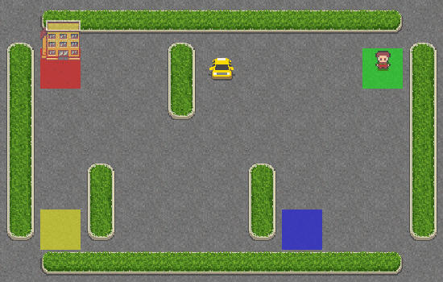

<p align="center">
  <br>
  <em>The Taxi-v3 agent efficiently navigating the grid world using Backward-View SARSA(λ)!</em>
</p>

<p align="center">
  <br>
  <em>Cliff Walking trained using Backward-View SARSA(λ) — smoother and more stable learning!</em>
</p>

<br><br>

# 🚕 Taxi-v3 & CliffWalking-v1 with **Backward-View SARSA(λ)** (State–Action–Reward–State–Action with Eligibility Traces) 🎯

Welcome to the **Taxi-v3** and **CliffWalking-v1** environments!
In this project, we train an agent to learn **optimal navigation policies** using the **Backward-View SARSA(λ)** algorithm — an enhanced version of SARSA that combines **Temporal-Difference (TD) learning** with **eligibility traces** to achieve **faster and more stable learning**. ⚡

Backward-View SARSA(λ) is a **model-free, on-policy TD control algorithm**. It improves upon classic SARSA by allowing learning signals (TD errors) to **propagate backward in time**, giving credit not only to the most recent state–action pair but also to **all past pairs** that led to it. This makes the algorithm **more data-efficient** and helps the agent **learn smoother, longer-term behaviors**.

---

## 🧠 **Backward-View SARSA(λ): A Brief Overview**

**Backward-View SARSA(λ)** extends the traditional SARSA algorithm by introducing **eligibility traces**, which act as a **short-term memory** of recently visited state–action pairs.

In standard SARSA, updates occur **only for the most recent** state–action pair:

```
Q(s, a) ← Q(s, a) + α [r + γ Q(s', a') − Q(s, a)]
```

In contrast, **Backward-View SARSA(λ)** updates **all previously visited** pairs in proportion to their eligibility, defined by:

```
E(s, a) ← γλE(s, a)
```

and applies the update:

```
Q(s, a) ← Q(s, a) + α δ E(s, a)
```

where δ (the TD error) is:

```
δ = r + γ Q(s', a') − Q(s, a)
```

---

### ⚡ **Why Backward-View SARSA(λ) is Better**

| Feature                  | Standard SARSA                    | Backward-View SARSA(λ)                                           |
| ------------------------ | --------------------------------- | ---------------------------------------------------------------- |
| **Credit Assignment**    | Updates only the last (s, a) pair | Propagates learning signal backward to many recent (s, a) pairs  |
| **Learning Speed**       | Slower, local updates             | Faster convergence due to broader updates                        |
| **Stability**            | Can fluctuate on noisy rewards    | Smoother and more stable due to averaging effect of traces       |
| **Memory of Experience** | None                              | Keeps a short-term "memory" of recent steps (eligibility traces) |
| **Performance**          | Good on short tasks               | Superior on long sequences (e.g., CliffWalking)                  |

---

### 🧩 **Intuition**

Think of eligibility traces as a **fade-out memory**:
recent state–action pairs are given high credit, while older ones gradually fade.
This allows the agent to efficiently **bridge the gap between cause and effect**, learning from delayed rewards much faster than plain SARSA.

---

## 🧭 **Backward-View SARSA(λ) in Taxi-v3 & CliffWalking-v1**

* **Taxi-v3** 🚖
  The agent learns to pick up and drop off passengers efficiently.
  Backward-View SARSA(λ) helps the taxi **remember** sequences of moves that lead to successful drop-offs, improving learning speed and stability.

* **CliffWalking-v1** 🧗
  The agent learns to cross the grid without falling off the cliff.
  Backward-View SARSA(λ) gives credit to earlier safe moves, enabling **smoother navigation** and reducing oscillations near the cliff edge.

---

## 🚖 About the Taxi-v3 Environment

**Taxi-v3** from **Gymnasium** simulates a taxi navigating a grid world to **pick up and drop off passengers** at designated locations.

### 🎯 Objective

Pick up the passenger and deliver them with the **fewest possible steps** while avoiding penalties.

| Space Type            | Description                                                             |
| --------------------- | ----------------------------------------------------------------------- |
| **Observation space** | 500 discrete states (taxi row, column, passenger location, destination) |
| **Action space**      | 6 discrete actions                                                      |

| Action | Description   |
| ------ | ------------- |
| 0      | Move South ⬇️ |
| 1      | Move North ⬆️ |
| 2      | Move East ➡️  |
| 3      | Move West ⬅️  |
| 4      | Pick Up 🚖    |
| 5      | Drop Off 🎯   |

| Event               | Reward  |
| ------------------- | ------- |
| Successful drop-off | **+20** |
| Each timestep       | **-1**  |
| Illegal pickup/drop | **-10** |

---

## 🧗 About the CliffWalking-v1 Environment

**CliffWalking-v1** represents an agent navigating a grid while avoiding a cliff with heavy penalties.

| Space Type            | Description                    |
| --------------------- | ------------------------------ |
| **Observation space** | 48 discrete states (4×12 grid) |
| **Action space**      | 4 discrete actions             |

| Action | Description   |
| ------ | ------------- |
| 0      | Move Left ⬅️  |
| 1      | Move Down ⬇️  |
| 2      | Move Right ➡️ |
| 3      | Move Up ⬆️    |

| Event          | Reward   |
| -------------- | -------- |
| Reach Goal     | **0**    |
| Step Normally  | **-1**   |
| Fall off Cliff | **-100** |

Backward-View SARSA(λ) enables the agent to learn **safer and more direct paths**, crediting sequences of steps that avoided the cliff.

---

## 🧾 **Algorithm: Backward-View SARSA(λ)**

**Input:**

* Environment with state set **S** and action set **A**
* Learning rate **α**
* Discount factor **γ**
* Trace decay rate **λ**
* Exploration rate **ε**
* Number of episodes **N**

**Output:**

* Optimal action-value function **Q*(s, a)**
* Policy **π*(s)**

**Steps:**

1. Initialize **Q(s, a)** and **E(s, a)** (eligibility traces) to 0.

2. For each episode:

   * Initialize state **s** and action **a** (ε-greedy).
   * Repeat for each step:

     1. Take action **a**, observe **r** and **s′**.
     2. Choose next action **a′** (ε-greedy).
     3. Compute TD error: `δ = r + γ Q(s′, a′) − Q(s, a)`
     4. Increment eligibility: `E(s, a) ← E(s, a) + 1`
     5. Update all Q-values: `Q ← Q + α δ E`
     6. Decay traces: `E ← γλE`
     7. Set **s ← s′**, **a ← a′** until episode ends.

3. Derive final policy: **π*(s) = argmaxₐ Q(s, a)**

---

## 🧠 **Key Advantages of Backward-View SARSA(λ)**

 ✅ **Faster convergence** – propagates learning signals across multiple time steps.

 ✅ **Better credit assignment** – rewards influence earlier decisions that contributed to success.

 ✅ **Improved stability** – smooths out updates, especially in noisy or long-horizon environments.

 ✅ **Generalizes classic SARSA** – setting λ = 0 recovers the standard SARSA algorithm.

---

## 🛠️ Let’s Set Up the Project! 🚀

```bash
# Install uv package
curl -LsSf https://astral.sh/uv/install.sh | sh
```

### 📦 Initialize the Example

```bash
cd examples/008
uv python pin 3.12
uv init
rm main.py
uv venv --python 3.12
```

### 📥 Install Project Dependencies

```bash
uv add -r requirements.txt # we are in examples/008
```

### 🚀 Launch Jupyter Notebook

```bash
uv run jupyter notebook --ip='*' --NotebookApp.token='' --NotebookApp.password=''
```

Your **Backward-View SARSA(λ) agent** is now ready to learn optimal, memory-augmented navigation in **Taxi-v3** and **CliffWalking-v1**! 🧠⚡
Watch as it learns **faster, smoother, and smarter** than ever before.

---

