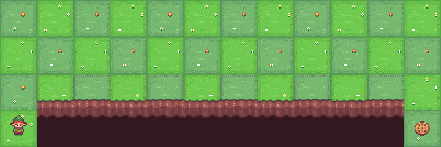

<p align="center">
  <br>
  <em>The Taxi-v3 agent efficiently navigating the grid world using Q-learning!</em>
</p>

<p align="center">
  <br>
  <em>CliffWalking trained by Q-learning!</em>
</p>

<br><br>

# 🚕 Taxi-v3 & CliffWalking-v1 with Q-Learning 🎯

Welcome to the **Taxi-v3** and **CliffWalking-v1** environments!
In this project, we teach an agent to learn **optimal policies** in two classic reinforcement learning environments using **Q-learning** — a powerful **off-policy temporal-difference (TD) control method**. 🌟

Q-learning is **model-free**, meaning it **does not require knowledge of transition probabilities**. The agent learns from its interactions, always aiming to maximize future rewards by updating Q-values toward the best possible action, rather than the action actually taken.

---

## **Q-Learning: A Brief Overview**

**Q-learning** is a fundamental reinforcement learning algorithm used to find the optimal policy of an agent interacting with an environment. It is an **off-policy** method, which means the agent learns about the optimal policy independently of the actions it actually takes.

Unlike **SARSA**, which updates Q-values based on the **next action chosen by the current policy**, Q-learning updates Q-values based on the **maximum possible reward in the next state**, moving directly toward the optimal policy.

The key update rule in Q-learning is:

%20%5Cleftarrow%20Q\(s_t%2C%20a_t\)%20%2B%20%5Calpha%20%5Cleft%5B%20r_%7Bt%2B1%7D%20%2B%20%5Cgamma%20%5Cmax_a%20Q\(s_%7Bt%2B1%7D%2C%20a\)%20-%20Q\(s_t%2C%20a_t\)%20%5Cright%5D)

Where:

* ) is the action-value function,
*  is the reward for taking action  in state ,
*  is the discount factor,
*  is the learning rate.

Notice that **Q-learning uses the best possible next action** rather than the one actually taken, making it **off-policy**.

---

### **Exploration vs. Exploitation in Q-learning**

Just like SARSA, Q-learning uses **ε-greedy policies** to balance exploration and exploitation:

* With probability (1 - ε), the agent takes the **greedy action** (highest Q-value).
* With probability ε, the agent explores by taking a **random action**.

Even with high exploration, the Q-values are always updated toward the **optimal policy**, so the agent eventually converges to the **shortest or most rewarding path**, unlike SARSA where ε can make the agent safer or riskier depending on exploration.

---

### **Q-Learning in Taxi-v3 & CliffWalking-v1**

In both environments, Q-learning learns the optimal policy efficiently:

* **Taxi-v3**: The agent navigates a taxi in a grid world to pick up and drop off passengers, minimizing penalties. Q-learning quickly learns the **shortest, optimal routes** for every state.
* **CliffWalking-v1**: The agent learns the optimal path across a cliff-laden grid. Unlike SARSA, which can stay away from the cliff with high ε, Q-learning always converges toward the **closest-to-cliff, optimal path**, regardless of exploration rate.

---

## 🧠 Q-Learning Algorithm Overview

**Q-learning** is an **off-policy Temporal-Difference control algorithm**.
It updates its Q-values toward the **best possible action** in the next state.

---

### 🔄 Key Idea

At each step, the agent observes:

```
(s, a, r, s')
```

Then updates the Q-value as:

```
Q(s, a) ← Q(s, a) + α [r + γ max_a Q(s', a) − Q(s, a)]
```

Where:

* **α** = learning rate
* **γ** = discount factor
* **r** = reward received
* **max_a Q(s', a)** = the estimated value of the **best action** in the next state

---

### 🧾 Algorithm: Q-Learning

**Input:**

* Environment with states **S** and actions **A**
* Learning rate **α**
* Discount factor **γ ∈ [0, 1)**
* Exploration rate **ε** for ε-greedy policy
* Number of episodes **N**

**Output:**

* Optimal action-value function **Q*(s, a)**
* Policy **π*(s) = argmaxₐ Q(s, a)**

**Steps:**

1. Initialize **Q(s, a)** arbitrarily (e.g., zeros)
2. For each episode:

   * Initialize **s**
   * For each step in the episode:

     * Choose **a** using ε-greedy policy
     * Take action **a**, observe **r** and **s'**
     * Update: `Q(s, a) ← Q(s, a) + α [r + γ max_a Q(s', a) − Q(s, a)]`
     * Set **s ← s'**
   * Optionally decay **ε**

---

### 🧭 Intuition

1. Start by exploring the environment randomly.
2. Update Q-values toward the **best possible next action**.
3. Gradually shift from exploration to exploitation.
4. Learn **shortest and most rewarding paths** for both environments.

---

## ⚡ When to Use SARSA vs. Q-Learning

| Algorithm  | Type       | Behavior                                                                        | Best For                                                                          |
| ---------- | ---------- | ------------------------------------------------------------------------------- | --------------------------------------------------------------------------------- |
| SARSA      | On-policy  | Learns policy based on **actual actions**; safer under high exploration         | Risk-sensitive tasks, e.g., avoiding cliffs                                       |
| Q-Learning | Off-policy | Learns **optimal policy** regardless of exploration; converges to shortest path | Tasks requiring fastest convergence and optimal reward, e.g., Taxi routing, games |

**Key takeaway:**
Use **SARSA** when safety or following your current policy matters. Use **Q-learning** when you want the agent to always aim for the **globally optimal policy**.

---

## 🛠️ Let’s Set Up the Project! 🚀

```bash
# Install uv package
curl -LsSf https://astral.sh/uv/install.sh | sh
```

---

### 📦 Initialize the Example

```bash
# Navigate to the example folder
cd examples/009

# Pin Python version
uv python pin 3.12

# Initialize new project
uv init
rm main.py

# Create virtual environment
uv venv --python 3.12
```

---

### 📥 Install Project Dependencies

```bash
# Inside examples/009/
uv add -r requirements.txt
```

---

### 🚀 Launch Jupyter Notebook

```bash
uv run jupyter notebook --ip='*' --NotebookApp.token='' --NotebookApp.password=''
```

Your **Q-learning agent** is now ready to learn optimal navigation in **Taxi-v3** and **CliffWalking-v1**! 🧠⚡

